# A CRM system module

## How it works

### Adding the user

Currently there are no users in the database.

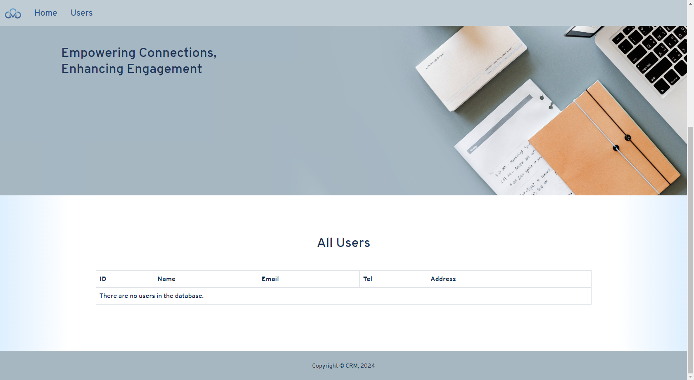

Let's add one!

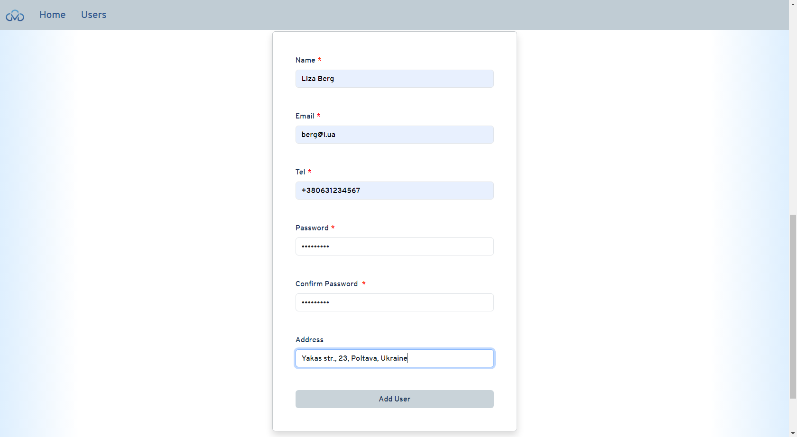

After we're done, if there are no validation errors, we see this toast.

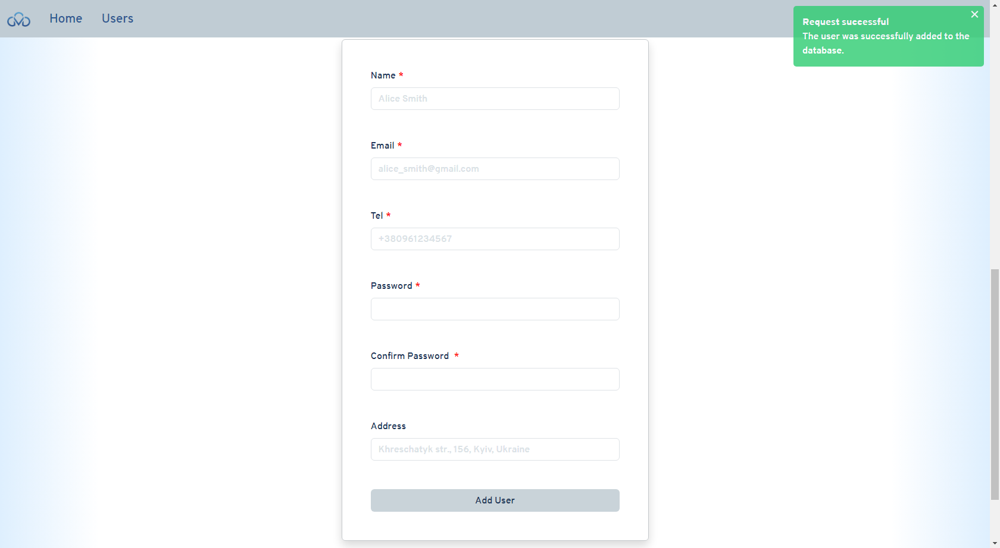

Let's see what (or who) we have.

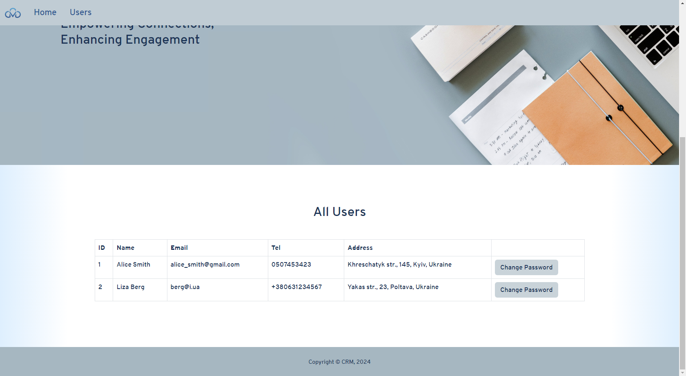

Nice! We have successfully added some users.

What if we provide invalid data? Let's see!

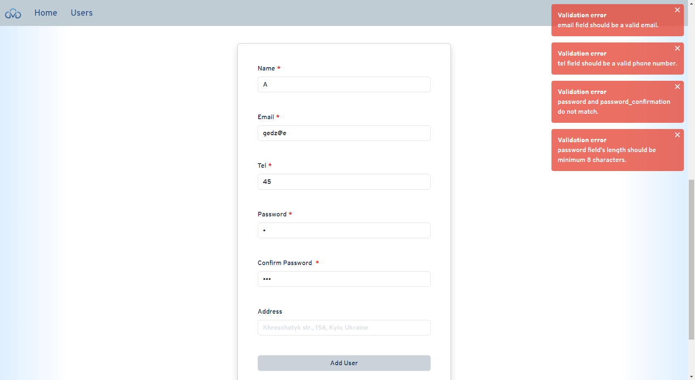

Let's try to provide someone else's email.

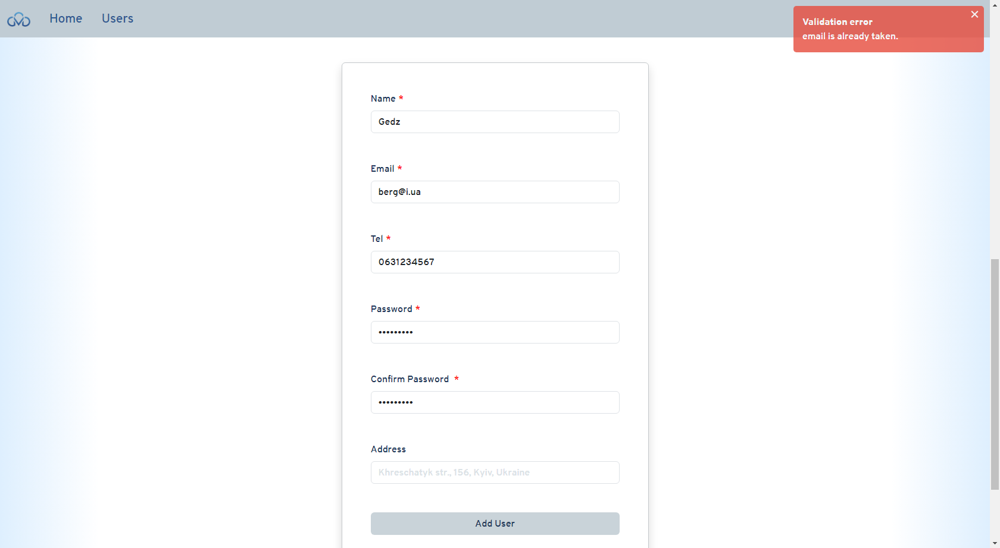

### Changing the password

Let's change the first user's password. To test this, we first need to put some garbage into the `password` field. Let's do this in phpMyAdmin.

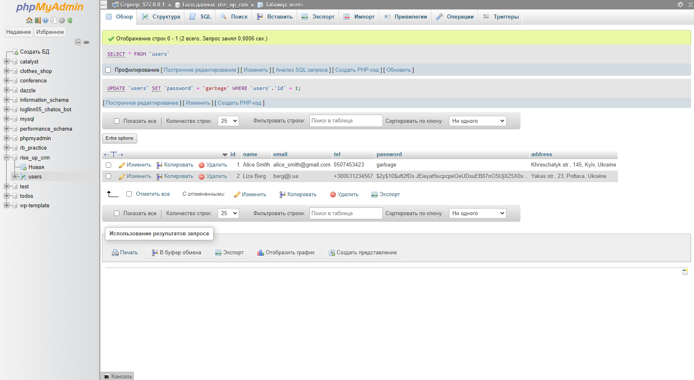

Now, let's click that "Change Password" button. We'll see a popup.

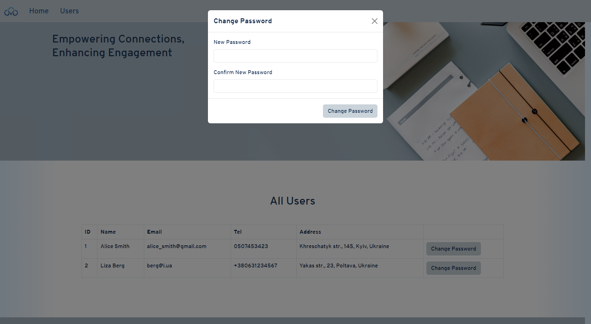

Let's enter a new password and confirm it.

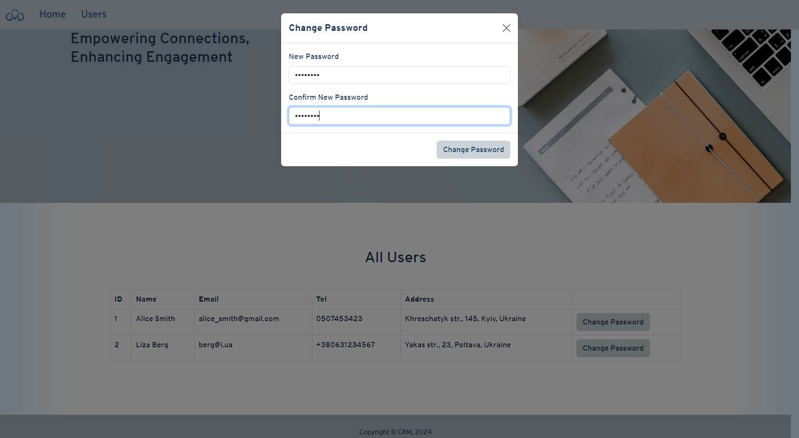

We have provided valid data, so we see this green notification.

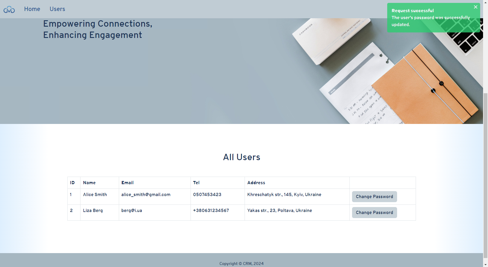

It really worked!

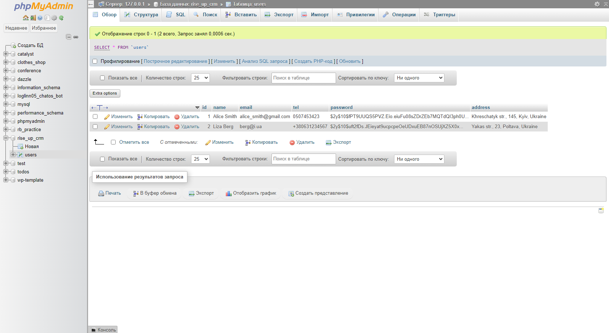

Now let's try to provide invalid data, for example, a password that's too short or is not the same as its confirmation.

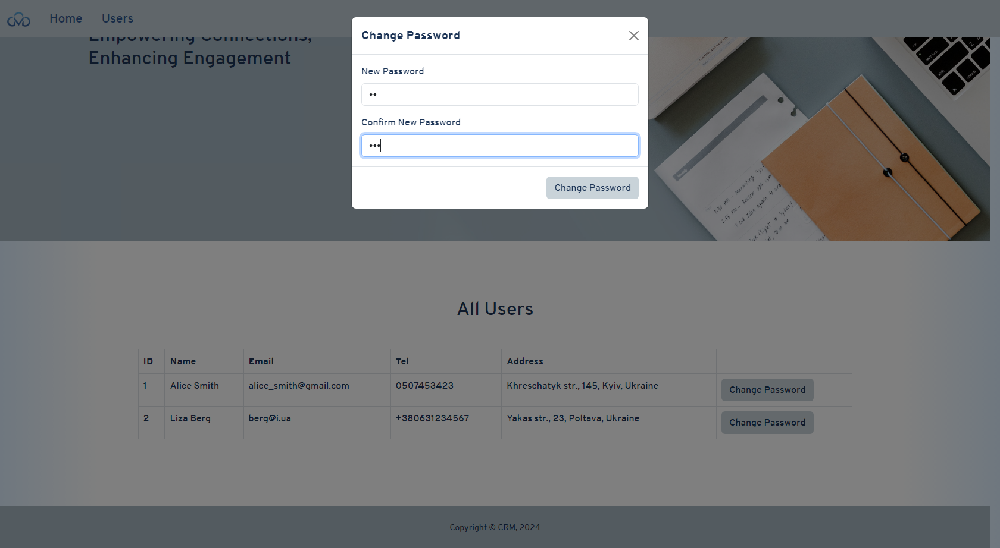

And we see validation errors, as expected.

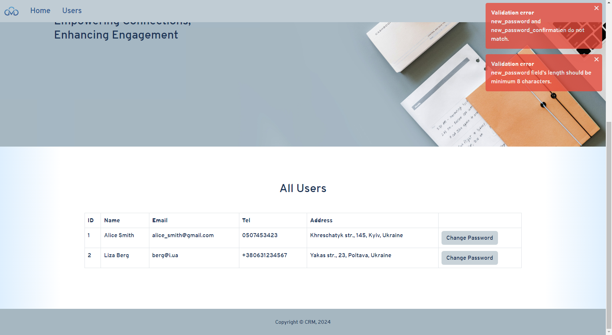
